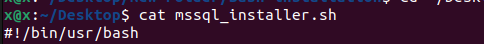

# Bash-installation
This repo contains bash files to be able to install some programs using one command
Available linux softwares till now is 
- MSSQL For `Debian (Ubuntu)` Servers
- MSSQL For `Debian (Ubuntu)` local pc
- PostgreSQL14 for `Debian (Ubuntu)`server
- PostgreSQLPgAdmin for `Debian (Ubuntu)` server and local pc 

## Prerequests :

know which bash does your machine use

```bash
sudo which bash
output example => /usr/bin/bash
```
    make sure that path is the same on file you want to run if there is difference => replace the `path on file` with the `command output`  
    

## How to run
1) navigate to file -You want to run- path
2) run the following
    ```bash
    sudo chmod +x ./<file name>.sh
    sudo bash ./<file name>.sh
    ```

